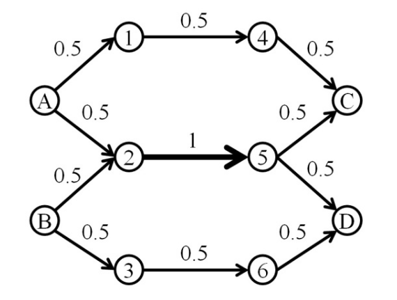
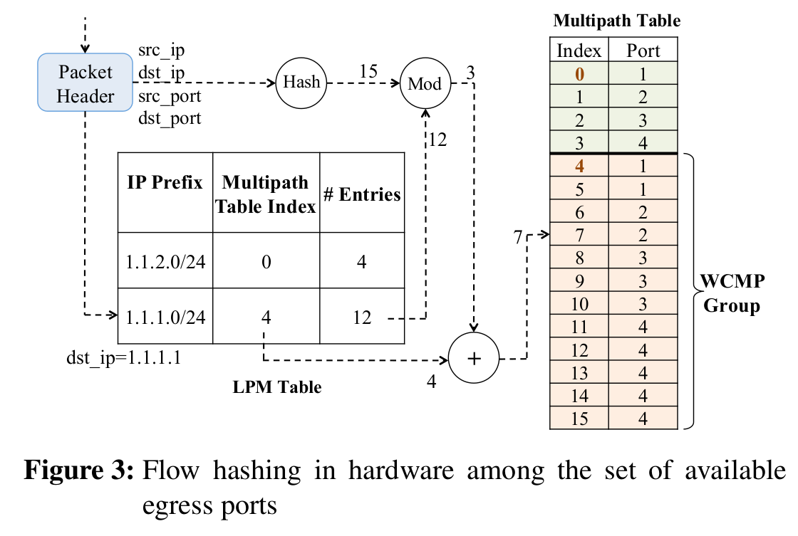
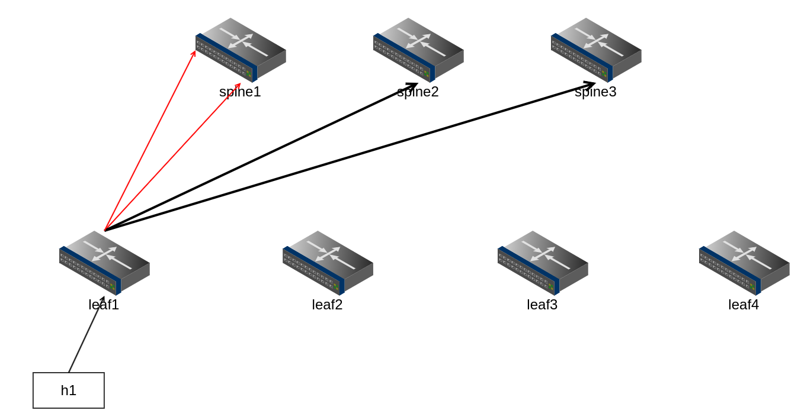

# WCMP

Weighted Equal-Cost Multi-Path Routing 的實際演練。

## WCMP Mechanism 

* 以往 ECMP 的作法是把 incoming packet 做 Hash (e.g. 5-tuple) 後，平均指定到某個 port 上（基於 switch 上頭 available egress port 數量而定）。
* 基於簡單的 topology 上合適，不過當 link 涉及 aggregate 時，這樣的作法便會造成問題 - 如下圖所示，在 switch A, B 都採用 ECMP 機制時，對於 switch 1,3 沒有影響（其所承受的負載為 0.5），但對於匯流點 switch 2，就會將兩個 0.5 匯流成 1，這樣當 switch 之間的承載能力不同時，便會造成網路中 Load balancing 的問題： 

> 參考 Reference - [1] 的圖片。

而 WCMP 的概念便是將 `權重值 (weight)` 的概念放在 Match/Action Entries 上，回想 ECMP 的匹配方式 - 透過 Hash 來做 index 的選擇（e.g. 選擇對應到的 key-value pair）; WCMP 加入的權重值，則是依據每個 egress port 的 available bandwidth 來產生其重複的 key-value pairs，讓 weight 愈高的 egress port，佔有的 entry 數量愈多，被 hash 到的機率也相對較高。

> 參考 Reference - [2] 的圖片。

WCMP 主要針對 ECMP 的兩個缺點做解決： 
1. 解決 Asymmetry topology 的問題（e.g. `Link failure` 的發生）
2. 改進公平性問題 （ ECMP 不管 link bandwidth，採用全部齊頭式的平等 ），而 WCMP 機制下能夠提供 flow bandwidth 的有效使用、以及達到 Load balancing 的效果。

## 延伸討論 

`WCMP group size 的縮減`： 在 WCMP group 當中，每個 egress port 所選擇的權重會影響到 table entries 的數量。 而如何選擇 weight 則可以節省 table entries，進而節省到 TCAM 的使用、以及影響 network performance。可以參考 Reference [2] 當中提及的 *WCMP Weight Reduction Algorithm* 來察看如何有效地控制 weight、並可以有效減少 entries size。

## Demo 

> Work in progress

* Topology for scenario (`Spine`: `s5~7`, `Leaf`: `s1~4`)

* Downlink (For all `Spine`)

* Uplink (For `s1`)

在 `S1` 這邊特別讓他跟 spine1 (e.g. s5) 有兩條連線，區別於其他都是只有一條與 spine 相連。這邊就會展示與 ECMP 不同的一個地方，來宣稱 WCMP 能有更好的 Load balancing 效果。

* Normal Uplink (For normal leaf)

### P4 switch 

利用 pre-installed rules (e.g. sX-runtime.json) 來為我們這個 scenario 來做初始化。並呼叫 `./build.sh` 建立事先定義好的 topology (via `topology.json`)

一樣讓 h1 送目標 IP 為 `10.0.0.1` 的封包，在 switch 上做 5-tuple 的 hashing （ 與 ECMP 相同 ），並對應到其連接的 Spine 上，並做 nexthop 的指定。

## Reference
[1] http://engineering.nyu.edu/highspeed/research/past-projects/weighted-equal-cost-multi-path-routing.

[2] [WCMP: Weighted Cost Multipathing for Improved Fairness in Data Centers](http://www.sysnet.ucsd.edu/sysnet/miscpapers/wcmp-eurosys-final.pdf). Junlan Zhou, Malveeka Tewari, Min Zhu, Abdul Kabbani, Leon Poutievski, Arjun Singh, Amin Vahdat.